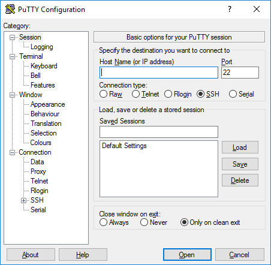

*******************
Connecting to Marcy
*******************
Users connect to Marcy through a command line terminal using the `Secure Shell <https://www.ssh.org>`_
(SSH) protocol. This works differently on different operating systems, so we provide instructions for the
two most common operating systems.

Mac OS X or Linux
=================
Open a `command line terminal <https://help.gnome.org/users/gnome-terminal/stable/>`_  on your local
computer (``localhost``) and use the ``ssh`` command.

.. code-block:: bash

   localhost$ ssh username@marcy.furman.edu

Passwordless SSH on Mac OS
--------------------------
The user's local SSH key must be installed on Marcy to allow passwordless SSH.

Checking for a Previous Key
"""""""""""""""""""""""""""
Open a command line terminal on your local computer (``localhost``) and list the home directory
contents including hidden files/folders.

.. code-block:: bash

   localhost$ ls -al

If the folder ``.ssh`` exists and contains the files ``id_rsa`` and ``id_rsa.pub`` a previously-generated
SSH key exists and can be used. If the folder ``.ssh`` does NOT exist, the user must generate a new
SSH key.

Generating a New Key
""""""""""""""""""""
Use the ``ssh-keygen`` command and accept the default configurations in the resulting prompts.

.. code-block:: bash

   localhost$ ssh-keygen

This will create the folder ``/Users/username/.ssh`` which contain the files ``id_rsa`` and ``id_rsa.pub``.

Installing Key on Marcy
"""""""""""""""""""""""
Change directory to the ``.ssh`` folder.

.. code-block:: bash

   localhost$ cd /Users/username/.ssh

Create a temporary ``authorized_keys`` file containing your public key.

.. code-block:: bash

   localhost$ cp id_rsa.pub temporary_authorized_keys

Transfer the temporary file to Marcy.

.. code-block:: bash

   localhost$ scp temporary_authorized_keys username@marcy.furman.edu:/home/username/.ssh/authorized_keys

This completes the SSH key installation and allows passwordless SSH and SCP.

SSH on Windows
==============
Windows users must use a secure shell client. `PuTTY <https://putty.org>`_ is the recommended
program for this task, so we will this program in the instructions below.

Download and install `PuTTY <https://putty.org>`_ on your local computer (``localhost``). Open
a new SSH connection and edit the prompt accordingly. Enter ``marcy.furman.edu`` in the
`Host Name` box and click `Open`. A command line terminal will open and ask for your account
credentials. Enter your username and password to gain access to Marcy.

Passwordless SSH on Windows
---------------------------

.. toctree::
   :maxdepth: 4
