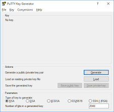

SSH on Windows
==============
Windows users must use a secure shell client. `PuTTY <https://putty.org>`_ is the recommended
program for this task, so we will this program in the instructions below.

Download and install `PuTTY <https://putty.org>`_ on your local computer (``localhost``). Open
a new SSH connection and edit the prompt accordingly. Enter ``marcy.furman.edu`` in the
`Host Name` box and click `Open`. A command line terminal will open and ask for your account
credentials. Enter your username and password to gain access to Marcy.

.. image:: putty.png

Passwordless SSH on Windows
---------------------------

Generating Keys
"""""""""""""""
Open the PuTTYgen program by going to

    Start Menu -> All Programs -> PuTTY -> PuTTYgen

You will be presented with the following window:

Click `Generate` to generate a new set of keys. Save the keys by clicking on `Save Public Key`
and `Save Private Key`. Now copy the public key to the clipboard by highlighting the key in the box.

Installing Keys
"""""""""""""""
Open a new command line terminal and log into Marcy.

.. code-block:: bash

    username@localhost:~$ ssh username@marcy.furman.edu

Open a new file ``/home/username/.ssh/authorized_keys`` with any text edit program. For
`Vim <https:www.vim.org>`_, use the command:

.. code-block:: bash

    username@localhost:~$ vim /home/username/.ssh/authorized_keys

Press ``I`` to enter edit mode and paste your public key into the file. Exit edit mode by pressing
`Esc`. Save the file and exit by typing ``:wq`` into the Vim command prompt and pressing `Enter`.
This completes the SSH key installation.

.. toctree::
   :maxdepth: 4
   :caption: Contents
